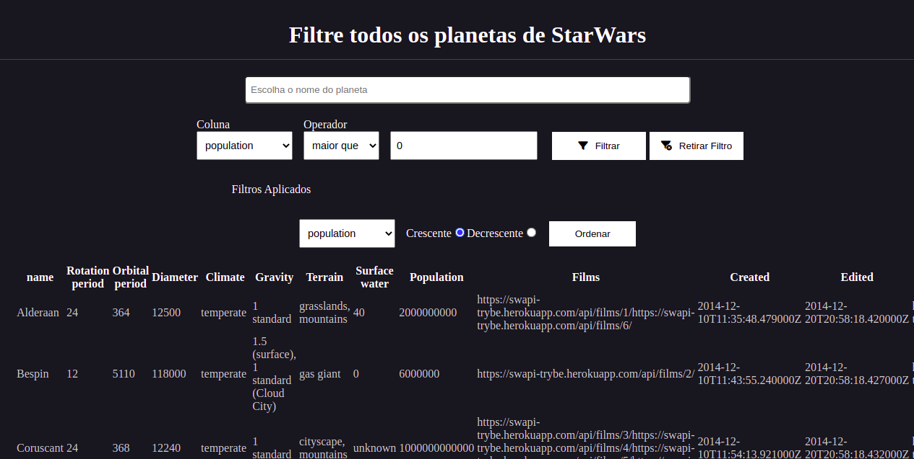

<h1 align="center">
     <a href="#" alt="site de despesa"> StarWars Planetas</a>
</h1>

<h3 align="center">
    Lógica de filtros com React Hooks utilizando API.
</h3>

<h4 align="center">
	🚧   Concluído 🚀 🚧
</h4>

Tabela de conteúdos
=================
<!--ts-->
   * [Sobre o projeto](#-sobre-o-projeto)
   * [Funcionalidades](#-funcionalidades)
   * [Layout](#-layout)
   * [Tecnologias](#-tecnologias)

<!--te-->

## 💻 Sobre o projeto

Este projeto tem como objetivo aprender a utilizar lógicas de filtros em dados a partir do React. Para isso foi manipulado informações de uma API que apresenta os planetas que apareceram nos filmes de StarWars. 

---

## ⚙️ Funcionalidades

- [x] Manipulação de API
- [x] Filtrar dados de Texto
- [x] Filtrar dados a partir de vários parâmetros numéricos. 
- [x] Lógica de remoção de filtros colocados
- [x] Ordernar colunas de forma ascendente ou descendente

---

## 🎨 Layout

  

## 🛠 Tecnologias

As seguintes ferramentas foram usadas na construção do projeto:

-   **React Router Dom**
-   **React**
-   **Hooks**

